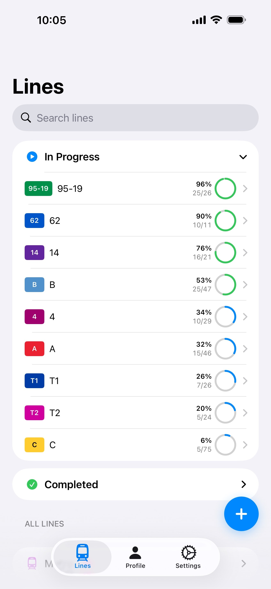
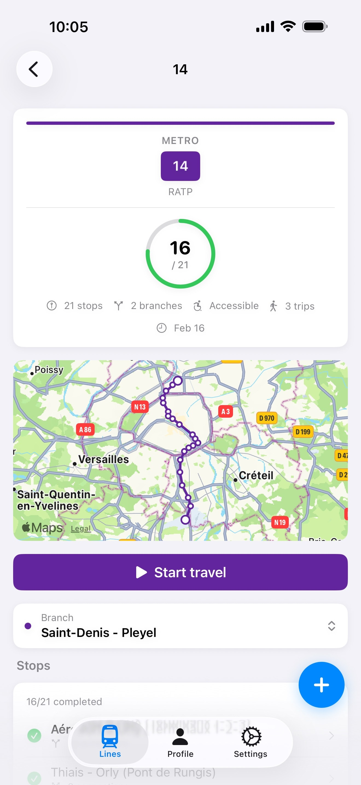
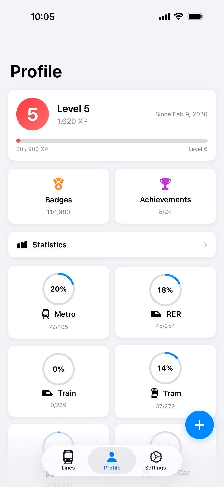
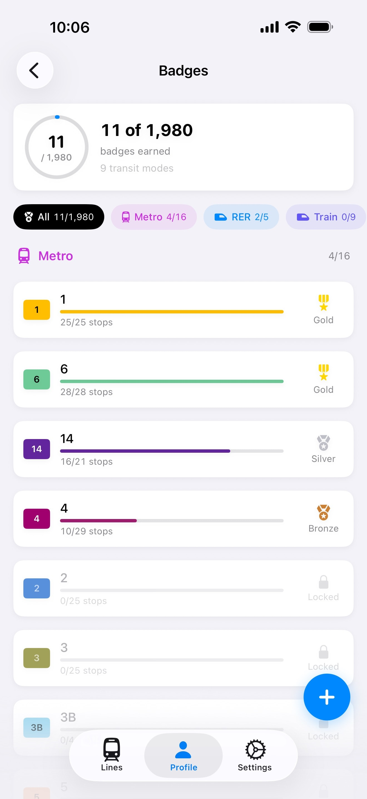
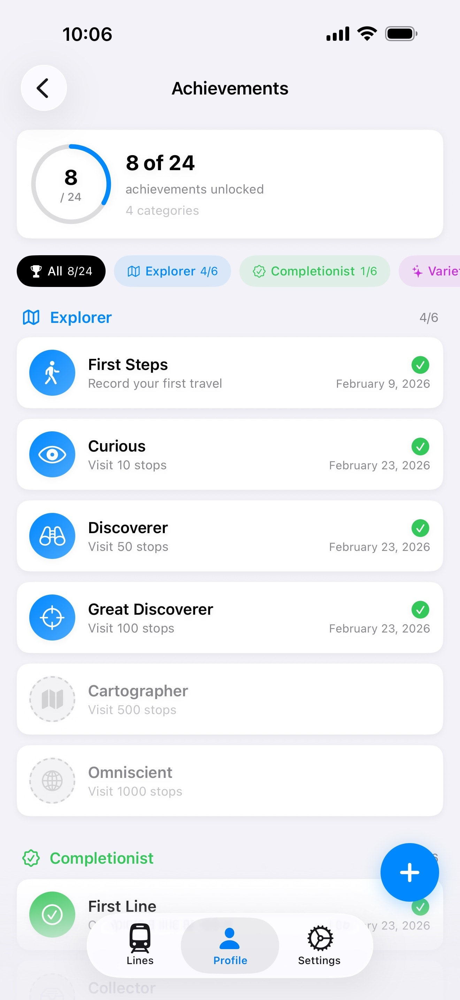

# Métropolist

A native iOS app to explore, track, and complete every transit station in the Paris region (Île-de-France), with gamification, iCloud sync, and zero dependencies.

  
  
  
  

  
  
  
  
  

  

## Features

- Browse all transit lines in the Paris region: Metro, RER, Train, Tram, Bus, Cable Car, Funicular, and more
- Track visited stations and log your travels across the network
- Gamification system with XP, levels, badges, achievements, and streaks
- View per-line and per-mode completion progress
- View line routes on an interactive map
- Sync your progress across devices with iCloud
- Export and import your travel data as JSON
- Offline-first: all transit data is bundled with the app, no network required
- Fully native with zero third-party dependencies

## Supported Transit Modes

- Metro
- RER
- Train
- Tram
- Bus
- Cable Car
- Funicular
- Regional Rail
- Rail Shuttle

## Requirements

- iOS 17.0+

## Localization

Métropolist is localized in 2 languages:

English, French
